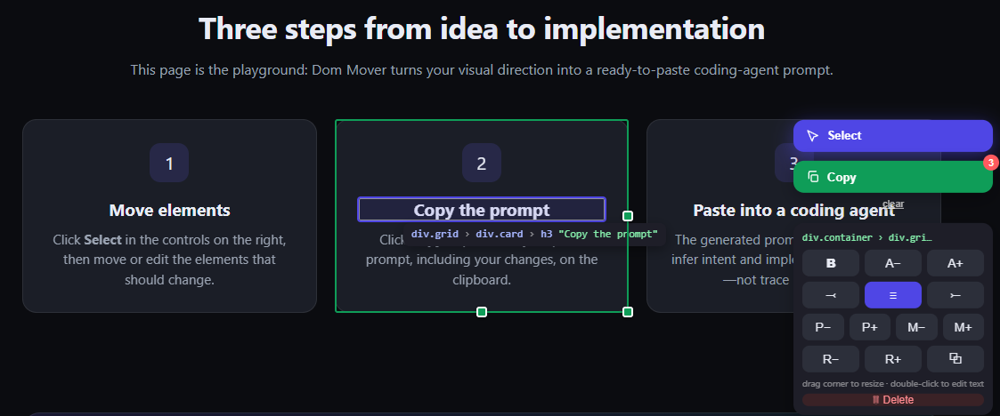

# DOM Mover

A vibe-coded sketch of a browser tool idea: visually direct changes to an existing page, then copy a structured brief for a coding agent.

Move, resize, restyle, edit, duplicate, or remove page elements. Dom Mover records the direction behind those changes; it does not edit source code.



## Try it

Open [`index.html`](./index.html) in a browser, or add the script to a page:

```html
<script src="dom-mover.js"></script>
```

1. Click **Select**, then move or edit the elements that should change.
2. Click **Copy** to put a ready-to-paste coding-agent prompt on your clipboard.
3. Paste that prompt into your coding agent. It includes implementation guidance and the changes you recorded.

## What gets copied

Dom Mover generates a prompt like this, followed by the actual changes you made:

```text
These DOM Mover captures from https://example.com are visual directions, not a pixel-perfect specification.
Treat recorded offsets and dimensions as relative cues for the intended result, never as literal values to reproduce.

Before changing code:
- Inspect the affected template/DOM and stylesheet, then briefly explain the inferred intent in plain language.
- Decide whether each request needs a CSS layout adjustment or a DOM/template change.
- Prefer CSS for alignment, ordering, spacing, and sizing when the existing elements already have the required semantic relationship.
- Restructure the template only when the intended relationship, reading order, or component ownership genuinely changes.

Implementation guidance:
- Do not translate captured values into fixed px rules. Use em for typography and component-scaled dimensions, and reuse the project's existing spacing and sizing tokens for gaps and offsets.
- Treat measured sizes as proportional starting points. Follow the project's existing design system and responsive conventions.
- A delete request means the element should not render in the requested context; do not merely hide it with CSS. Preserve it elsewhere only when that is intentional.
- Keep the result responsive: validate the intended desktop direction and a usable narrow-screen layout.

Changes (2 elements):

1. a.btn "Main CTA"
   selector: div.actions > a.btn:nth-of-type(1)
   moved: 80px right
   now near: before a.btn "See the idea"  (div.actions > a.btn:nth-of-type(2))

2. h3 "Move elements"
   selector: div.card:nth-of-type(1) > h3
   style: font-weight 700; text-align center
```

This is an exploratory prototype, not a production-ready visual editor.

## License

[MIT](./LICENSE)
